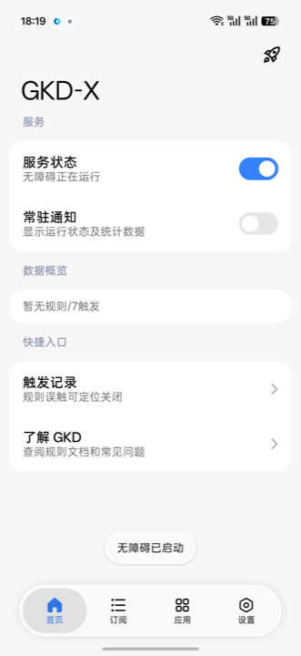
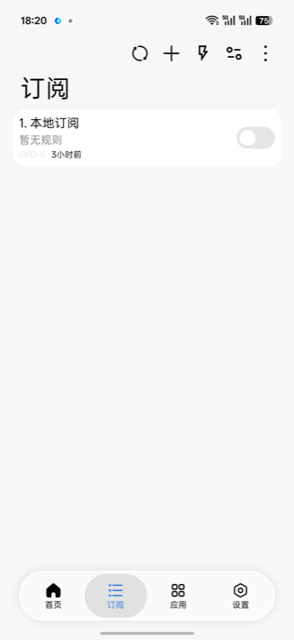
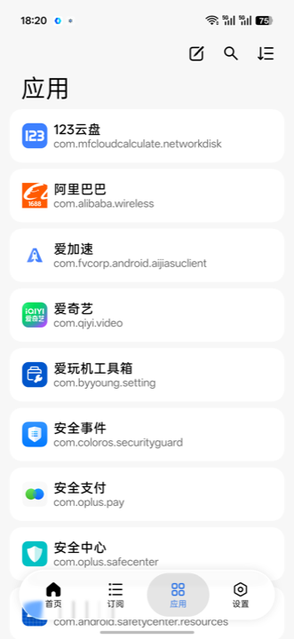
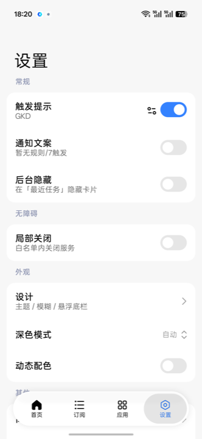

# GKD-X (gkd-miuix)

基于 [GKD](https://github.com/gkd-kit/gkd) 的 Android 自定义屏幕点击应用分支，界面全面适配 [compose-miuix-ui](https://github.com/compose-miuix-ui/miuix)。

通过自定义规则，在指定界面满足条件（如屏幕存在特定文字）时，点击节点、位置或执行其他操作。

- **应用品牌**：GKD-X（`applicationId`: `li.songe.gkdx`）
- **界面**：MIUIX（顶栏 / 底栏 / 设置分组 / 对话框 / 图标等）
- **能力**：与上游 GKD 相同的选择器、订阅规则、快照与自动化能力

## 界面预览（MIUIX）

| 首页 | 订阅 | 应用 | 设置 |
| :---: | :---: | :---: | :---: |
|  |  |  |  |

> 悬浮底栏、大标题顶栏、分组卡片与开关等组件来自 [compose-miuix-ui](https://github.com/compose-miuix-ui/miuix)。

## 免责声明

**本项目遵循 [GPL-3.0](/LICENSE) 开源，仅供学习交流，禁止用于商业或非法用途。**

上游 GKD 项目声明同样适用，请遵守当地法律法规。

## 与上游的关系

| 项目 | 说明 |
| ---- | ---- |
| 上游 | [gkd-kit/gkd](https://github.com/gkd-kit/gkd) |
| 本仓库 | [hanchuan8/gkd-miuix](https://github.com/hanchuan8/gkd-miuix) |
| 文档 / 选择器说明 | 仍可参考 <https://gkd.li> |
| 订阅规则 | 兼容 GKD 订阅格式，可使用社区订阅 |

## 安装

从本仓库 [Releases](https://github.com/hanchuan8/gkd-miuix/releases) 下载安装包。

也可自行编译：

```bash
./gradlew :app:assembleGkdRelease
```

如遇规则 / 选择器问题，可先查阅上游 [疑难解答](https://gkd.li/guide/faq)。

## 主要改动（相对上游）

- 全量 MIUIX 界面与图标资源
- 首页、设置等使用 Preference 分组布局
- 触发提示支持悬浮窗 / Toast / 实时通知等样式
- 订阅页改为顶栏刷新（取消下拉刷新）

## 开源致谢

本项目在 [GKD](https://github.com/gkd-kit/gkd)（GPL-3.0）基础上开发，并使用了下列开源项目（不完全列表）：

| 项目 | 说明 | 链接 |
| ---- | ---- | ---- |
| **compose-miuix-ui** | MIUIX 风格 Compose 组件 / Preference / Icons / Blur | [compose-miuix-ui/miuix](https://github.com/compose-miuix-ui/miuix) |
| **GKD** | 核心自动化、选择器与订阅能力 | [gkd-kit/gkd](https://github.com/gkd-kit/gkd) |
| Jetpack Compose | UI 框架 | [androidx/compose](https://developer.android.com/jetpack/compose) |
| AndroidX / Room | 应用基础组件与本地数据库 | [AndroidX](https://developer.android.com/jetpack) |
| Ktor | 网络请求 | [ktorio/ktor](https://github.com/ktorio/ktor) |
| Shizuku | 特权 API 调用 | [RikkaApps/Shizuku](https://github.com/RikkaApps/Shizuku) |
| XXPermissions | 权限请求 | [getActivity/XXPermissions](https://github.com/getActivity/XXPermissions) |
| Toaster | Toast | [getActivity/Toaster](https://github.com/getActivity/Toaster) |
| DeviceCompat | 设备兼容 | [getActivity/DeviceCompat](https://github.com/getActivity/DeviceCompat) |
| compose-webview | WebView | [KevinnZou/compose-webview](https://github.com/KevinnZou/compose-webview) |
| reorderable | 列表拖拽排序 | [Calvin-LL/Reorderable](https://github.com/Calvin-LL/Reorderable) |

完整依赖与版本见 [`gradle/libs.versions.toml`](gradle/libs.versions.toml)。各自许可证以原项目为准。

## 订阅

默认不内置规则，需自行添加本地规则或通过订阅链接获取远程规则。

第三方订阅可参考：<https://github.com/topics/gkd-subscription>

## 反馈

问题与建议请提交到本仓库 Issues：

<https://github.com/hanchuan8/gkd-miuix/issues>
